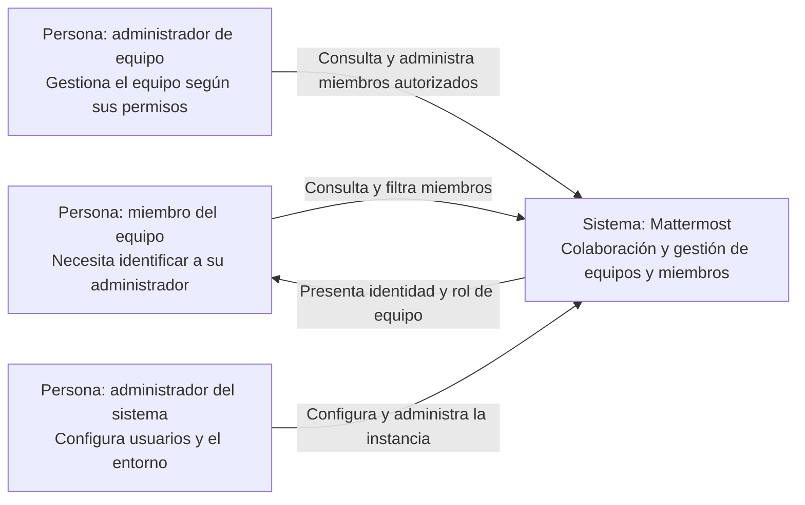

# Entregable 1 — Identificación de administradores de equipo en Mattermost

**Universidad CENFOTEC — Escuela de Ingeniería de Software**
**Curso:** C3-PSWE, Procesos de Ingeniería de Software — C3 2026
**Docente:** Shirley Ramírez Cordero
**Grupo:** [Nombre del grupo]
**Integrantes:** A: [Nombre]; B: [Nombre]; C: [Nombre]
**Entrega:** semana 6, del 5 al 11 de octubre de 2026; fecha y hora exactas según Moodle.

> **Nota editorial — retirar antes de entregar:** completar los campos entre corchetes. La ejecución de la base, la reproducción y la publicación del repositorio siguen pendientes de evidencia. Renderizar el diagrama al exportar y verificar el máximo de cinco páginas, incluyendo referencias y coevaluación; evitar una portada independiente. Este borrador no acredita actividades todavía no realizadas.

## 1. Título y contexto del proyecto

**Título:** Mejora de la identificación de administradores de equipo en Mattermost y evaluación del proceso de implementación.

**Propósito.** Facilitar que los miembros de un equipo identifiquen a sus administradores desde la aplicación web. Paralelamente, evaluar cómo el grupo planifica, estima, coordina, revisa y entrega la mejora, utilizando evidencia para detectar esperas, retrabajo y oportunidades de ajuste. El resultado incluirá tanto una funcionalidad verificable como una evaluación del proceso seguido [1, 3].

**Dominio y usuario meta.** Mattermost es una plataforma de colaboración para organizaciones que coordina conversaciones mediante equipos y canales. El usuario meta es un miembro que necesita identificar a la persona responsable de atender una solicitud administrativa de su equipo. También participan administradores de equipo y del sistema como usuarios de validación.

**Funcionalidades existentes.** La plataforma cuenta con mensajería, equipos, canales y administración de miembros. Se trabajará sobre el módulo de gestión de equipos de la aplicación web, dentro del sistema existente [2, 4].

**Estado actual.** El issue público **#37406, “Add Ability to discover team admin”**, fue creado el 8 de julio de 2026 y aparece abierto en la fuente consultada. Describe limitaciones para reconocer y filtrar administradores en las listas de miembros; la alternativa reportada requiere consultar la consola del sistema [2]. La fecha corresponde a su publicación en GitHub, sincronizada desde Jira, y cumple el límite de seis meses establecido por el grupo al 21 de septiembre de 2026. La versión concreta y la persistencia del problema deberán comprobarse en la base seleccionada.
https://github.com/mattermost/mattermost/issues/37406

## 2. Mejora propuesta

### 2.1 Problema, situación propuesta y motivación

El reporte solicita distinguir administradores de equipo y facilitar su localización desde las vistas de miembros, sin requerir acceso a la consola del sistema [2]. El grupo propone resolverlo mediante una identificación visual y un filtro por rol.

La motivación es reducir la dependencia de intermediarios para encontrar a quién dirigir una solicitud. El beneficio esperado se demostrará con un recorrido antes/después; no se afirma todavía una reducción medida del tiempo de búsqueda.

**Alcance máximo:** mostrar el rol de administrador de equipo e incorporar su filtro en las vistas web de miembros correspondientes. La búsqueda y paginación deberán conservar resultados consistentes. Se mantendrán las autorizaciones actuales.

**Exclusiones:** asignar o retirar roles, cambiar permisos, agregar mensajería o solicitudes administrativas, rediseñar la consola, modificar clientes móviles y crear un directorio entre equipos. Tampoco se promete que el cambio sea integrado por los mantenedores; la entrega académica se realizará en el repositorio del grupo.

Esta delimitación combina análisis de requisitos, diseño de interacción, revisión de datos y validación, con una demostración visible y un ámbito que puede estudiar un equipo de tres integrantes. Su esfuerzo se confirmará mediante inspección del módulo.

### 2.2 Validación del estado inicial y criterios de aceptación

Antes de entregar este avance, se preparará un equipo de prueba con miembros y administradores, y se revisarán las vistas disponibles desde cada rol. Se registrarán versión, commit, pasos y capturas, distinguiendo lo reportado externamente de lo observado por el grupo. En esta etapa no se implementará la mejora [1].

**Evidencia inicial:** [Enlace a capturas y registro de reproducción, con fecha y resultado].

| ID | Criterio propuesto para la implementación posterior |
|---|---|
| CA-01 | La identificación visual corresponde al rol real dentro del equipo consultado. |
| CA-02 | El filtro devuelve los administradores del equipo, incluidos los que no aparecían en la primera página sin filtrar. |
| CA-03 | Búsqueda y filtro se combinan correctamente; se contempla un resultado vacío. |
| CA-04 | La consulta no habilita acciones de gestión a usuarios sin autorización ni revela miembros de otros equipos. |
| CA-05 | Se conserva la navegación existente y el nuevo control puede operarse mediante teclado. |

Durante el análisis se documentará el tratamiento de una persona que tenga más de un rol. No se equiparará automáticamente el rol global con la pertenencia al conjunto de administradores de un equipo; se verificará la semántica existente antes de fijar los resultados esperados.

## 3. Retos técnicos y habilidades

| Reto | Abordaje previsto | Habilidades requeridas |
|---|---|---|
| Preparar una base accesible para los tres | Registrar dependencias y pasos; comprobar inicio de sesión y acceso al escenario con cada integrante. | Git, entorno de desarrollo y servicios locales. |
| Comprender roles y datos disponibles | Identificar cómo se obtienen y presentan las membresías; distinguir roles globales y del equipo. | Lectura de código, modelo de permisos y API. |
| Integrar el filtro con búsqueda y paginación | Verificar si el filtrado requiere apoyo del servidor; evitar filtrar únicamente los datos de la página cargada. | React/TypeScript, estado de interfaz y Go si procede. |
| Evitar regresiones y validar accesibilidad | Preparar casos por rol, tamaño de lista y combinación de filtros; reutilizar las prácticas de pruebas del módulo. | Pruebas funcionales, automatización y revisión de interfaz. |

No se presupone que la corrección se limite al frontend. Se revisará esa dependencia antes de estimar la implementación. Los tres deberán disponer de recursos para ejecutar y validar el escenario, sin depender de funciones de pago o hardware especializado [1, 4].

## 4. Proceso de trabajo y evaluación administrativa

Se propone un ciclo incremental con un tablero Kanban: **pendiente → lista para iniciar → en implementación → en revisión → en validación → entregada**. Los bloqueos y devoluciones se registrarán. El enfoque adapta las prácticas de gestión al tamaño del equipo y permite comparar el proceso previsto con el ejecutado [3].

Cada tarea tendrá un responsable, un revisor distinto y una persona que valide el resultado. Los roles rotarán; todos participarán en desarrollo y documentación. Se limitará inicialmente a dos tareas en implementación para reservar capacidad de revisión. Habrá una reunión semanal breve para revisar avance, capacidad, riesgos y decisiones.

Una tarea estará lista al contar con alcance, aceptación y estimación. Para entregarla se requerirán revisión de otro integrante, pruebas aplicables y evidencia. Después del avance 1 se utilizarán ramas breves, pull requests y GitHub Actions para ejecutar las verificaciones seleccionadas. Se conservará la relación entre requisito, tarea, cambio y prueba.

### Medición prevista

Estas métricas se anticipan para orientar la captura de datos; su definición operativa y resultados se desarrollarán en los siguientes entregables.

| Métrica | Obtención | Meta provisional y utilidad |
|---|---|---|
| Lead time por tarea | Tiempo desde aceptación en el plan hasta entrega validada. | Mediana de hasta cinco días hábiles para tareas acotadas; investigar esperas y tamaño. |
| Espera de revisión | Desde “lista para revisar” hasta inicio efectivo de revisión. | Al menos 80 % dentro de dos días hábiles; ajustar disponibilidad y trabajo en curso. |
| Aceptación sin retrabajo (%CA) | Entregas aceptadas en primera validación / entregas evaluadas × 100. | Al menos 80 %; analizar devoluciones por criterios incumplidos o defectos. |

Se registrarán cantidades y causas junto con los porcentajes. Las metas son acuerdos iniciales propuestos, no requisitos de la profesora, y se revisarán justificadamente tras la primera iteración. Las comparaciones entre iteraciones considerarán diferencias de complejidad y tamaño de muestra; no se atribuirá causalidad a una mejora con pocos datos.

Se conservarán estimaciones y horas-persona reales por tarea. El costo de esfuerzo se calculará con una tarifa académica explícita y separada de los desembolsos reales. Cualquier cambio de alcance registrará motivo, efecto sobre tiempo/costo y decisión consensuada. Los riesgos iniciales son instalación demorada, dependencia no prevista del servidor y resolución externa del issue; se revisarán antes de implementar y durante el seguimiento semanal.

## 5. Calendario de hitos y responsables

A coordina entorno y análisis técnico; B, requisitos e interacción; C, validación y evidencia. Son coordinaciones, no funciones exclusivas. Los tres revisarán los entregables.

| Semana y fechas de 2026 | Hito / evidencia | Coordinación |
|---|---|---|
| 4: 21–27 sep. | Inspeccionar issue y módulo; preparar entorno; acordar disponibilidad semanal. | A |
| 5: 28 sep.–4 oct. | Reproducir, registrar base, delimitar alcance, aceptación y C4; estimar trabajo. | A y B |
| 6: 5–11 oct. | Entregar avance 1, base funcional, documentación y coevaluación. Sin código de la mejora. | C |
| 7: 12–18 oct. | Incorporar retroalimentación; detallar tareas, flujo y captura de métricas. | B |
| 8: 19–25 oct. | Acordar reglas de roles y diseño; iniciar implementación posterior al avance 1. | A y B |
| 9: 26 oct.–1 nov. | Completar identificación visual; revisar y validar el primer incremento. | B |
| 10: 2–8 nov. | Integrar filtro con búsqueda/paginación; automatizar pruebas y revisar primeras métricas. | A y C |
| 11: 9–15 nov. | Entregar avance 2 y demostración parcial, proceso CI/CD, riesgos, costos y métricas. | C |
| 12: 16–22 nov. | Aplicar ajustes del proceso y resolver observaciones funcionales y de seguridad. | A y B |
| 13: 23–29 nov. | Completar regresión, accesibilidad, evaluación de métricas y ensayo de defensa. | C |
| 14: 30 nov.–6 dic. | Entrega y presentación final con resultados, costos, riesgos y lecciones aprendidas. | Los tres |

Las fechas exactas se ajustarán a Moodle y a la presentación asignada, considerando el feriado del 1 de diciembre. La semana 13 se reserva para consolidación. **Disponibilidad acordada:** A: [horas/semana]; B: [horas/semana]; C: [horas/semana]. Esta capacidad determinará la estimación final y los ajustes del plan.

## 6. Versión inicial y arquitectura preliminar

**Repositorio del grupo:** [URL real de GitHub].
**Origen:** https://github.com/mattermost/mattermost
**Versión y SHA base:** [Completar con la revisión ejecutada].
**Validación de ejecución:** [Fecha, entorno y evidencia de los tres integrantes].

El repositorio deberá incluir la base funcional, instrucciones verificadas, alcance y exclusiones, criterios de aceptación, evidencia inicial y el siguiente C4 de contexto. Se recomienda conservar una etiqueta `avance-1-base` para comparar resultados. La publicación y la etiqueta están pendientes de comprobación.

El diagrama representa el nivel 1 de C4. Los roles pueden corresponder a una misma persona; no se descomponen aquí los componentes internos. El escenario propuesto no necesita integraciones externas. GitHub es una herramienta del proceso de desarrollo, no una dependencia funcional de esta mejora.

## 7. Coevaluación del primer avance

Las notas se completarán según la escala indicada por la docente y las contribuciones efectivamente realizadas.

| Integrante | Nota sugerida | Justificación / evidencia |
|---|---|---|
| [Nombre A] | [Completar] | [Actividades y enlaces verificables] |
| [Nombre B] | [Completar] | [Actividades y enlaces verificables] |
| [Nombre C] | [Completar] | [Actividades y enlaces verificables] |

## 8. Referencias y uso de IA

1. Ramírez Cordero, S. *C3-PSWE: Consigna completa del proyecto final del curso y entregables 1–2*, pp. 1–11, y cronograma C3 2026. Universidad CENFOTEC.
2. Mattermost. [Issue #37406: Add Ability to discover team admin](https://github.com/mattermost/mattermost/issues/37406). Fuente pública consultada el 21 de septiembre de 2026.
3. Ramírez Cordero, S. Presentaciones del curso: *Clase 01: Fundamentos de procesos*, pp. 3, 12 y 22; *Clase 02: Modelado de procesos*, pp. 7–9 y 13; *Clase 03: Enfoques de gestión de proyectos de tecnología*, pp. 6 y 9–10. CENFOTEC, 2026.
4. Mattermost. [Repositorio oficial](https://github.com/mattermost/mattermost) y [guía del entorno de desarrollo](https://developers.mattermost.com/contribute/developer-setup/). Las dependencias concretas se fijarán según la revisión base.

**Uso de IA.** Se utilizó Codex para analizar la consigna y las presentaciones, comparar issues y preparar este borrador. El prompt de esta redacción fue: “Ahora, redactar un nuevo md con el contenido del entregable 1 apra el issue Mattermost #37406”. Las solicitudes anteriores establecieron el equipo de tres personas, el calendario, el límite de antigüedad y el foco en evaluación administrativa del proceso.

**Registro completo:** [Ruta o enlace a prompts, respuestas utilizadas, fecha y revisión humana]. El grupo deberá validar fuentes, reproducir el problema y ajustar los compromisos a su capacidad antes de entregar. No se implementó código de la funcionalidad para este avance. La asistencia de IA no sustituye las decisiones consensuadas ni la responsabilidad de los integrantes.
