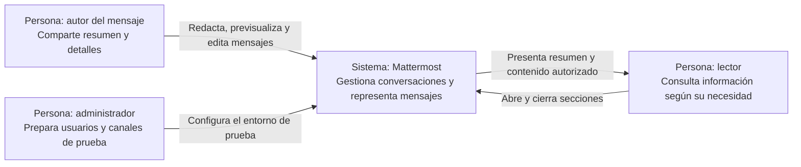

# Entregable 1 — Secciones desplegables en mensajes de Mattermost

**Universidad CENFOTEC — Escuela de Ingeniería de Software**
**Curso:** C3-PSWE, Procesos de Ingeniería de Software — C3 2026
**Docente:** Shirley Ramírez Cordero
**Grupo:** [Nombre del grupo]
**Integrantes:** A: [Nombre]; B: [Nombre]; C: [Nombre]
**Entrega:** semana 6, del 5 al 11 de octubre de 2026; fecha y hora exactas según Moodle.

> **Nota editorial — retirar antes de entregar:** completar los campos entre corchetes con información verificada. La instalación, la evidencia inicial y el repositorio del grupo están pendientes. Renderizar el diagrama al exportar y comprobar el límite de cinco páginas, incluyendo coevaluación y referencias. Este documento es una alternativa independiente de proyecto; no implica implementar simultáneamente las otras propuestas.

## 1. Título y contexto del proyecto

**Título:** Incorporación de secciones desplegables en mensajes de Mattermost y evaluación del proceso de implementación.

**Propósito.** Permitir presentar detalles extensos bajo un resumen que el lector pueda expandir. El propósito académico es evaluar la planificación, estimación, coordinación, revisión y entrega de esta mejora mediante evidencia de esperas, retrabajo y ajustes del proceso [1, 3].

**Dominio y usuario meta.** Mattermost es una plataforma de colaboración organizada en equipos y canales. La propuesta se dirige a personas que comparten información técnica extensa y a quienes necesitan consultar primero un resumen, manteniendo disponibles los detalles.

**Funciones existentes y estado actual.** La aplicación permite intercambiar mensajes con formato y contenido técnico. El issue **#38480** solicita secciones desplegables para evitar mostrar inicialmente todos los detalles de un mensaje [2]. Fue creado el 11 de septiembre de 2026 y figuraba abierto en la consulta previa del análisis. Cumple el límite de seis meses al 21 de septiembre de 2026. Su estado y la ausencia de la funcionalidad se volverán a comprobar en la base elegida.

https://github.com/mattermost/mattermost/issues/38480

## 2. Mejora propuesta

### 2.1 Problema, motivación y alcance

El problema reportado es la falta de un mecanismo para contraer por defecto detalles extensos dentro del mensaje [2]. Como alternativa operativa, el contenido puede compartirse completo o separarse del resumen; el grupo documentará el recorrido disponible en la versión base. No se presentan todavía observaciones locales.

Se propone una sección con resumen visible y contenido expandible. El beneficio esperado es facilitar la lectura de la conversación conservando el detalle disponible. La mejora se demostrará con el mismo mensaje antes y después; no se promete una reducción de tiempo de lectura sin medirla.

**Alcance máximo propuesto:** secciones no anidadas en mensajes web, con resumen de texto simple y cuerpo que admita texto, párrafos y bloques de código. La sintaxis concreta se acordará durante el análisis, tomando como referencia la solicitud de `details/summary`, sin habilitar HTML arbitrario. Se contemplan vista previa, mensaje publicado y edición; cada sección iniciará contraída y tendrá un control accesible.

**Exclusiones:** anidamiento, reproducción completa del Markdown de GitHub, adjuntos dentro de la sección, persistencia de preferencias de expansión, botones nuevos en la barra de formato y cambios en clientes móviles nativos. El contenido contraído seguirá disponible para los mismos usuarios autorizados a leer el mensaje; no constituye un control de confidencialidad.

### 2.2 Evidencia inicial y aceptación

Antes del avance 1 se ejecutará la base y se documentará cómo representa texto largo, bloques de código y un intento de sección desplegable. Se identificarán los componentes de vista previa y visualización, sin implementar la mejora [1].

**Evidencia pendiente:** [Versión, commit, pasos, capturas y resultado observado].

| ID | Criterio propuesto para la implementación posterior |
|---|---|
| CA-01 | Una sección válida inicia contraída; al abrirla muestra el cuerpo íntegro y al cerrarla conserva el resumen. |
| CA-02 | Párrafos y bloques de código incluidos se presentan correctamente en vista previa y publicación. |
| CA-03 | Editar y volver a abrir un mensaje conserva el contenido; mensajes sin secciones mantienen su comportamiento. |
| CA-04 | El control responde al teclado, muestra el foco y comunica su estado expandido/contraído. |
| CA-05 | Sintaxis incompleta o anidada tiene un comportamiento seguro y documentado; no ejecuta scripts ni habilita atributos arbitrarios. |

El alcance combina reglas de representación, interacción y validación. Su complejidad se confirmará inspeccionando el procesamiento de Markdown, antes de comprometer cambios de arquitectura.

## 3. Retos técnicos y habilidades

| Reto | Abordaje previsto | Habilidades |
|---|---|---|
| Entorno reproducible para los tres | Registrar dependencias y validar el escenario de mensajería en cada entorno. | Git, servicios locales y herramientas del proyecto. |
| Compatibilidad con Markdown | Localizar parser, sanitización y renderizado; fijar sintaxis admitida y comportamiento de entradas inválidas. | TypeScript, React y procesamiento de texto. |
| Consistencia entre vistas | Revisar componentes compartidos y evitar divergencias entre vista previa, publicación y edición. | Diseño de componentes y pruebas de regresión. |
| Accesibilidad y seguridad | Diseñar activación por teclado y casos con contenido no permitido. | Semántica web, pruebas de interfaz y revisión de seguridad. |

El principal riesgo es que la extensión exija modificar ampliamente el parser o sustituir dependencias. Se investigará antes de cerrar el alcance; una ampliación requerirá reestimar y revisar la propuesta. También se vigilarán la instalación y cambios externos que resuelvan el issue. El escenario debe poder ejecutarse con recursos accesibles para los tres, sin suscripciones ni hardware especializado [1, 4].

## 4. Proceso de trabajo y evaluación administrativa

Se propone un ciclo incremental con tablero Kanban: **pendiente → lista para iniciar → en implementación → en revisión → en validación → entregada**. Se registrarán bloqueos, devoluciones y decisiones para comparar el proceso previsto con el ejecutado mediante un mapa del flujo y sus esperas [1, 3].

Cada tarea tendrá responsable, revisor distinto y una persona que valide el resultado. Los roles rotarán para que los tres participen en desarrollo y documentación. Se limitará inicialmente a dos tareas en implementación simultánea, reservando capacidad para revisar. Una reunión semanal permitirá ajustar capacidad, riesgos y prioridades.

Una tarea estará lista cuando tenga alcance, aceptación y estimación. Para entregarla se requerirán revisión por otro integrante, pruebas pertinentes y evidencia. Después del avance 1 se usarán ramas breves, pull requests y GitHub Actions con las verificaciones del módulo. Se vincularán requisitos, tareas, cambios y pruebas. La entrega académica no dependerá de la aceptación de los mantenedores externos.

### Medición prevista

| Métrica | Obtención | Meta provisional |
|---|---|---|
| Lead time por tarea | Desde aceptación en el plan hasta entrega validada. | Mediana de hasta cinco días hábiles para tareas acotadas. |
| Espera de revisión | Desde “lista para revisar” hasta inicio efectivo de revisión. | Al menos 80 % dentro de dos días hábiles. |
| Aceptación sin retrabajo (%CA) | Entregas aceptadas en primera validación / entregas evaluadas × 100. | Al menos 80 %; analizar cada devolución por defecto o criterio incumplido. |

Las metas son propuestas del equipo, no exigencias de la profesora. Se acordará cómo registrar días hábiles y se revisarán justificadamente tras la primera iteración. Se conservarán cantidades y causas junto con porcentajes; una sugerencia opcional no contará como defecto.

La primera iteración proporcionará una línea base real. Una retrospectiva seleccionará un ajuste —por ejemplo, aclarar criterios o reservar horario de revisión— y se observará su resultado en las siguientes tareas. Las diferencias de complejidad y el tamaño reducido de la muestra limitarán las conclusiones; no se afirmará causalidad sin evidencia.

También se registrarán estimaciones y horas-persona reales. Los costos distinguirán desembolsos de una valoración académica del esfuerzo con tarifa explícita. Todo cambio de alcance indicará motivo, impacto sobre tiempo/costo y decisión consensuada. La evaluación de riesgos y costos se ampliará en el avance 2.

## 5. Calendario de hitos y responsables

A coordina entorno y análisis técnico; B, requisitos e interacción; C, validación y evidencia. Son coordinaciones, no funciones exclusivas. Los tres revisarán cada entregable.

| Semana y fechas de 2026 | Hito / evidencia | Coordinación |
|---|---|---|
| 4: 21–27 sep. | Revisar issue y módulo; preparar entorno y acordar disponibilidad. | A |
| 5: 28 sep.–4 oct. | Verificar estado inicial; registrar base; delimitar aceptación, alcance, C4 y estimación. | A y B |
| 6: 5–11 oct. | Entregar avance 1, base funcional, documentación y coevaluación. Sin código de la mejora. | C |
| 7: 12–18 oct. | Incorporar retroalimentación; detallar backlog y captura de métricas. | B |
| 8: 19–25 oct. | Acordar sintaxis y casos; iniciar representación básica después del avance 1. | A y B |
| 9: 26 oct.–1 nov. | Integrar secciones con vista previa y mensajes; revisar primer incremento. | B |
| 10: 2–8 nov. | Validar edición, teclado y entradas inválidas; automatizar regresión y revisar métricas. | A y C |
| 11: 9–15 nov. | Entregar avance 2 y demostración parcial; proceso CI/CD, riesgos, costos y métricas. | C |
| 12: 16–22 nov. | Aplicar ajustes del proceso y resolver observaciones funcionales y de seguridad. | A y B |
| 13: 23–29 nov. | Completar regresión, evaluación del proceso, documentación y ensayo de defensa. | C |
| 14: 30 nov.–6 dic. | Entrega y presentación final con resultados y lecciones aprendidas. | Los tres |

Las fechas exactas dependen de Moodle y de la presentación asignada; se considera el feriado del 1 de diciembre. La semana 13 reserva margen de consolidación. **Disponibilidad:** A: [horas/semana]; B: [horas/semana]; C: [horas/semana]. La capacidad acordada determinará los ajustes del plan.

## 6. Versión inicial y arquitectura preliminar

**Repositorio del grupo:** [URL real de GitHub].
**Origen:** https://github.com/mattermost/mattermost
**Versión y SHA base:** [Completar con la revisión ejecutada].
**Validación de ejecución:** [Fecha, entorno y evidencia de los tres integrantes].

El repositorio deberá contener la base funcional, instrucciones verificadas, alcance y exclusiones, criterios de aceptación, evidencia inicial y C4 de contexto. Se recomienda conservar una etiqueta `avance-1-base` para comparar resultados; su creación y la publicación están pendientes.

El diagrama representa el nivel 1 de C4: personas y sistema de interés. Los componentes internos no se descomponen aquí. El escenario no requiere integraciones externas. GitHub es una herramienta del proceso de desarrollo, no una dependencia funcional de la mejora.

## 7. Coevaluación del primer avance

Se completará según la escala de la docente y las contribuciones realizadas.

| Integrante | Nota sugerida | Justificación / evidencia |
|---|---|---|
| [Nombre A] | [Completar] | [Actividades y enlaces verificables] |
| [Nombre B] | [Completar] | [Actividades y enlaces verificables] |
| [Nombre C] | [Completar] | [Actividades y enlaces verificables] |

## 8. Referencias y uso de IA

1. Ramírez Cordero, S. *C3-PSWE: Consigna completa del proyecto final del curso y entregables 1–2*, pp. 1–11, y cronograma C3 2026. Universidad CENFOTEC.
2. Mattermost. [Issue #38480: Collapse Details of a Mattermost Message](https://github.com/mattermost/mattermost/issues/38480). Referencia del análisis del 21 de septiembre de 2026; confirmar vigencia antes de entregar.
3. Ramírez Cordero, S. Presentaciones: *Clase 01: Fundamentos de procesos*, pp. 3, 12 y 22; *Clase 02: Modelado de procesos*, pp. 7–9 y 13; *Clase 03: Enfoques de gestión de proyectos de tecnología*, pp. 6 y 9–10. CENFOTEC, 2026.
4. Mattermost. [Repositorio oficial](https://github.com/mattermost/mattermost) y [guía del entorno de desarrollo](https://developers.mattermost.com/contribute/developer-setup/). Dependencias por fijar según el commit base.

**Uso de IA.** Codex apoyó el análisis de la consigna, presentaciones e issues y la redacción de este borrador. Prompt de esta redacción: “Generar mds para Mattermost #38480 y Zulip #39161”. El contexto previo estableció tres integrantes, el calendario, el límite de seis meses y el enfoque de evaluación del proceso.

**Registro completo:** [Ruta o enlace a prompts, respuestas utilizadas, fechas y revisión humana]. Antes de entregar, el grupo validará referencias, funcionamiento de la base y compromisos de alcance. No se implementó código de la mejora para este avance. La asistencia de IA no sustituye las decisiones consensuadas ni la responsabilidad de los integrantes.
